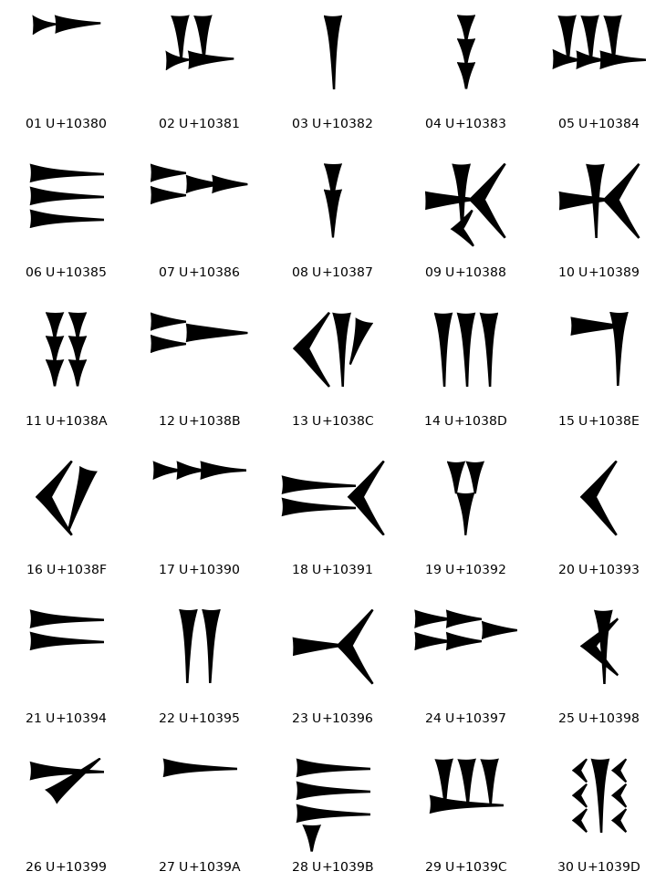
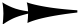
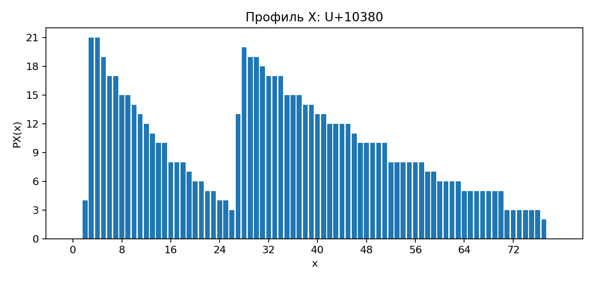
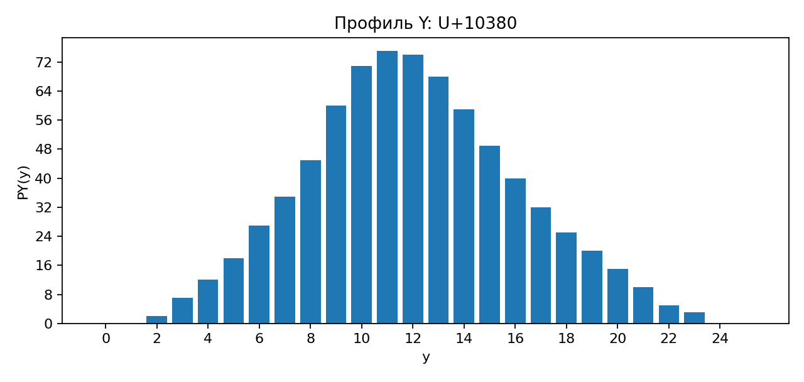
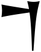
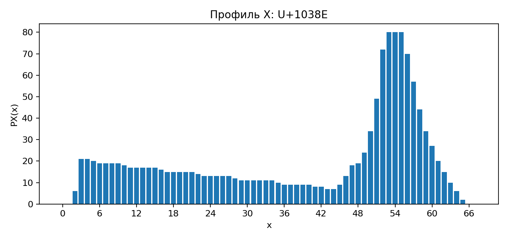
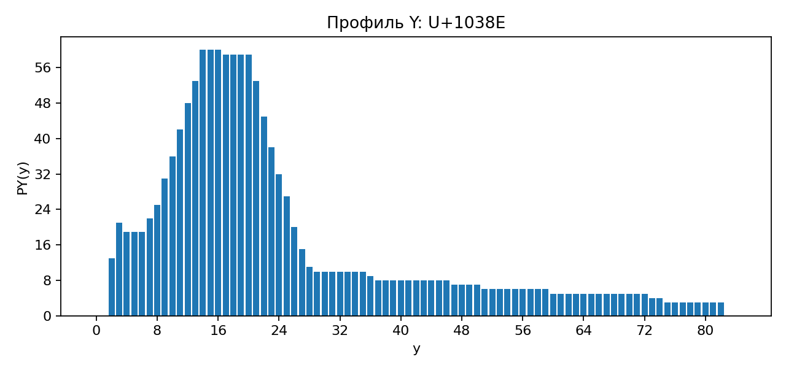
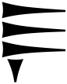
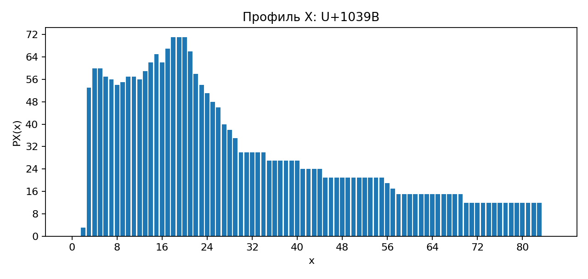
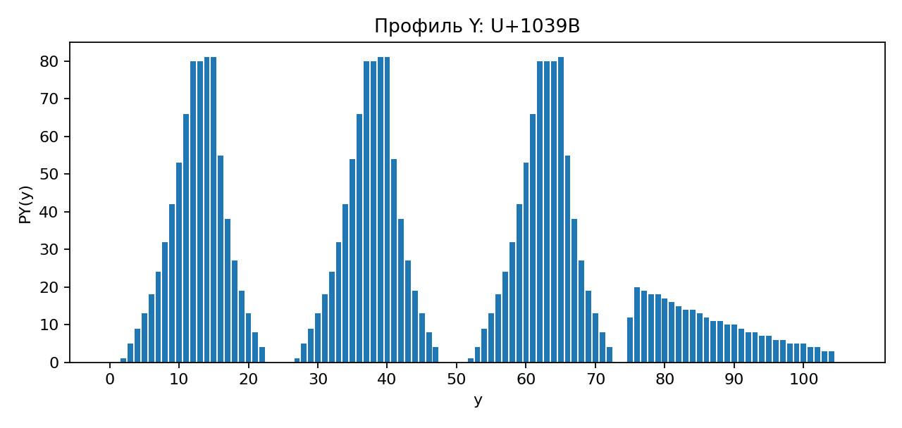

# Лабораторная работа №5

## Выделение признаков символов

### Вариант 11

Для варианта `11` по таблице задания выбран угаритский алфавит:

`𐎀 𐎁 𐎂 𐎃 𐎄 𐎅 𐎆 𐎇 𐎈 𐎉 𐎊 𐎋 𐎌 𐎍 𐎎 𐎏 𐎐 𐎑 𐎒 𐎓 𐎔 𐎕 𐎖 𐎗 𐎘 𐎙 𐎚 𐎛 𐎜 𐎝`

Всего сгенерировано `30` эталонных изображений символов.

### Что сделано в работе

1. Сгенерированы эталонные изображения всех символов выбранного алфавита.
2. Белые поля автоматически обрезаны.
3. Каждый символ сохранен по принципу `1 символ = 1 файл`.
4. Для каждого изображения вычислены все признаки из задания.
5. Скалярные признаки сохранены в `CSV` с разделителем `;`.
6. Профили `X` и `Y` сохранены в `PNG` в виде столбчатых диаграмм.

### Исходные данные

| Параметр | Значение |
|---|---|
| Алфавит | Угаритский |
| Шрифт | `NotoSansUgaritic-Regular.ttf` |
| Размер шрифта | `96` |
| Количество символов | `30` |
| Папка эталонов | `lab5_variant11_ugaritic/source_symbols` |
| Папка результатов | `lab5_variant11_ugaritic/results` |
| Скалярные признаки | `lab5_variant11_ugaritic/results/summary.csv` |

### Теория

В работе используется бинарная функция:

`f(x, y) ∊ {0, 1}`

где `1` соответствует чёрному пикселю символа, а `0` — белому фону.

#### 1. Вес и удельный вес четвертей

Вес символа соответствует нулевому моменту:

`m00 = Σ Σ f(x, y)`

Рамка символа делится на 4 четверти: верхняя левая, верхняя правая, нижняя левая и нижняя правая. Для каждой четверти считаются вес и удельный вес:

`specific_weight = weight_quarter / area_quarter`

#### 2. Центр тяжести

Координаты центра тяжести вычисляются через моменты первого порядка:

`xc = m10 / m00`

`yc = m01 / m00`

где

`m10 = Σ Σ x f(x, y)`

`m01 = Σ Σ y f(x, y)`

Нормированные координаты центра тяжести:

`xc_norm = xc / (M - 1)`

`yc_norm = yc / (N - 1)`

#### 3. Осевые моменты инерции

Через центральные моменты:

`μ20 = Σ Σ (x - xc)^2 f(x, y)`

`μ02 = Σ Σ (y - yc)^2 f(x, y)`

осевые моменты инерции берутся как:

`Iy = μ20`

`Ix = μ02`

Нормированные моменты инерции:

`Ix_norm = Ix / (M * N)`

`Iy_norm = Iy / (M * N)`

#### 4. Профили X и Y

Профиль представляет собой сумму чёрных пикселей вдоль выбранного направления:

`PX(x) = Σy f(x, y)`

`PY(y) = Σx f(x, y)`

В реализации профиль `X` строится по столбцам изображения, а профиль `Y` — по строкам сверху вниз.

### Реализация

1. Выбирается системный шрифт с поддержкой угаритского письма.
2. Для каждого символа строится отдельное бинарное изображение.
3. Белые поля автоматически обрезаются по рамке чёрных пикселей.
4. Эталон сохраняется в `source_symbols`.
5. Для каждого символа вычисляются скалярные признаки.
6. Строятся профили `X` и `Y`.
7. Формируется общая галерея и итоговый `CSV`.

Для каждого символа сохраняются:

* `00_symbol.png` — бинарное изображение символа;
* `01_profile_x.png` — профиль `X`;
* `02_profile_y.png` — профиль `Y`.

### Сводка по всему алфавиту

#### Общая галерея эталонов

#### Сводные наблюдения

| Признак | Минимум | Максимум |
|---|---|---|
| Общий вес | `𐎂` — `744` | `𐎛` — `2555` |
| Ширина | `𐎂` — `24` | `𐎑` — `118` |
| Высота | `𐎐` — `25` | `𐎛` — `107` |
| `xc_norm` | `𐎛` — `0.352370` | `𐎎` — `0.588535` |
| `yc_norm` | `𐎎` — `0.290634` | `𐎚` — `0.529372` |
| `Ix_norm` | `𐎚` — `4.881764` | `𐎃` — `224.996336` |
| `Iy_norm` | `𐎂` — `5.006918` | `𐎗` — `300.352597` |

Полный набор признаков для всех `30` символов сохранён в `results/summary.csv`.

### Подробные примеры

Ниже показаны несколько характерных символов. Полные результаты по всем символам лежат в `results/<symbol_id>/`.

#### Символ `𐎀`

Эталонное изображение:

Профиль `X`:

Профиль `Y`:

* Код: `U+10380`
* Название: `Alpa`
* Размер: `80 x 26`
* Вес: `752`
* Нормированный центр тяжести: `xc = 0.415314`, `yc = 0.480904`
* Нормированные моменты инерции: `Ix = 6.048373`, `Iy = 138.500869`

#### Символ `𐎎`

Эталонное изображение:

Профиль `X`:

Профиль `Y`:

* Код: `U+1038E`
* Название: `Mem`
* Размер: `68 x 85`
* Вес: `1343`
* Нормированный центр тяжести: `xc = 0.588535`, `yc = 0.290634`
* Нормированные моменты инерции: `Ix = 71.504437`, `Iy = 84.080885`

#### Символ `𐎛`

Эталонное изображение:

Профиль `X`:

Профиль `Y`:

* Код: `U+1039B`
* Название: `I`
* Размер: `86 x 107`
* Вес: `2555`
* Нормированный центр тяжести: `xc = 0.352370`, `yc = 0.410224`
* Нормированные моменты инерции: `Ix = 174.503160`, `Iy = 121.936751`
